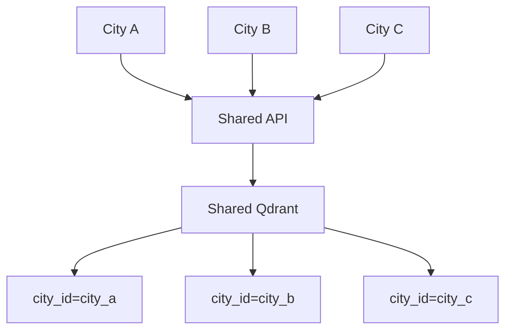

# OpenCity AI Whitepaper

## OpenCity AI: A Lightweight, Open-Source Municipal Knowledge Retrieval Platform

### Abstract

OpenCity AI is an open-source, multi-tenant platform that helps municipalities and civic technology communities improve access to public information using Retrieval-Augmented Generation (RAG). It is designed to complement existing city systems by providing a document-grounded retrieval and answer layer with source citations and predictable operating cost.

### 1. Problem

Cities publish service procedures, policy pages, and regulations across many systems. Citizens and staff often face information-access friction because the data is distributed, unevenly indexed, and updated over time.

### 2. Proposed System

### 3. Multi-Tenant Design

Each query is filtered by `city_id`, so retrieval stays scoped to the correct city corpus.

### 4. Knowledge Updates

1. Fetch document sources.
2. Compute content hash.
3. If changed: parse, chunk, embed, and upsert vectors.
4. Queries immediately use latest indexed version.

### 5. Cost Model (Pilot)

| Component | Typical Spec | Monthly Cost (USD) |
|---|---|---:|
| App + retrieval server | 4-8 vCPU, 8-16GB RAM | 40-100 |
| Storage volumes | Postgres + Qdrant | 5-20 |
| LLM inference | Open-source local runtime | Included in infra |
| Total (pilot range) | Single-node deployment | 45-120 |

### 6. Limitations

- Assistive retrieval system, not autonomous city decision-making.
- Accuracy depends on source quality and update discipline.
- Human verification is still required for high-stakes actions.

### 7. Conclusion

OpenCity AI provides practical civic value when positioned as knowledge infrastructure: transparent retrieval, source-cited responses, and low-cost deployment that can integrate with existing municipal systems.
